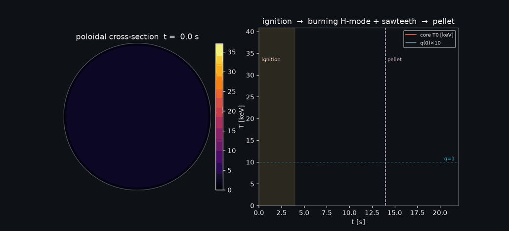
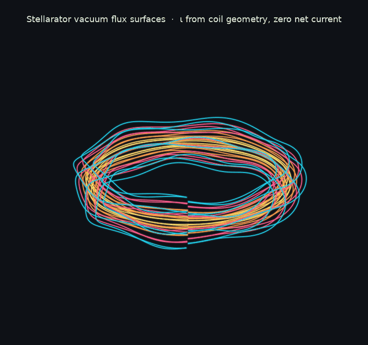
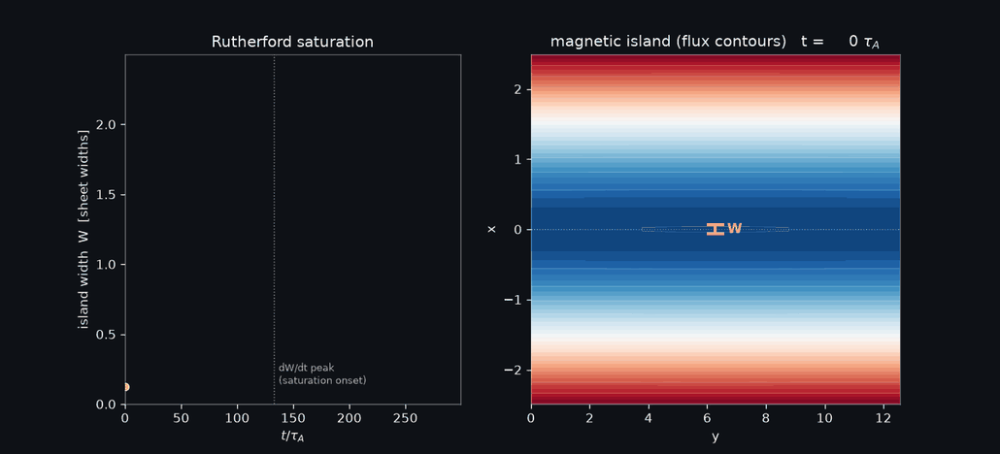
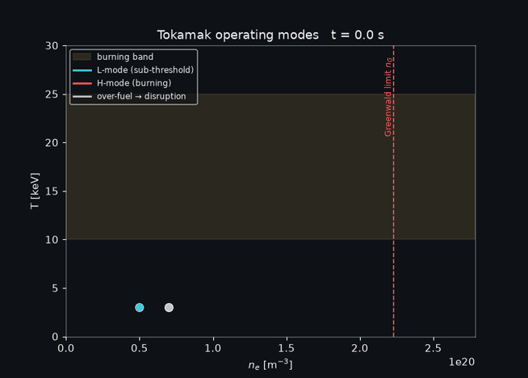

# plasma-playground — showcase 🔆

A gallery of the **money-shot** animations from this repo: self-contained plasma-physics
simulations of magnetic-confinement fusion, rendered to explain how a tokamak and a
stellarator actually confine and burn a plasma. Every gif is produced by validated code
(`python gif_gallery.py <name>`) backed by a falsifiable test — no hand-drawn diagrams,
no faked numbers. The physics behind each is summarized below.

> These are web-optimized copies (see [`scripts/build_assets.py`](../scripts/build_assets.py)).
> Full-resolution versions regenerate into `outputs/` (gitignored).

---

## 1 · The burning tokamak — the whole machine in one frame

The headline. A deuterium–tritium plasma **ignites, burns, and is fuelled** on a rotating
3-D tokamak, with the full confinement picture overlaid:

- **Glowing torus** — the plasma surface, colored by its **core temperature** (black → gold
  as it ignites to ~35 keV). The translucent glow lets you see inside.
- **Cyan confinement field lines** — the helical magnetic field that *holds* the plasma,
  lying on the nested flux surfaces. They twist with the **rotational transform ι = 1/q**
  (the safety factor), tighter in the core where q → 1.
- **Silver coils** — the real hardware: **toroidal-field rings** around the tube **+ the
  central solenoid** (the transformer up the middle that drives the toroidal plasma
  current, which in turn makes the poloidal field and the twist).
- **Right panel — the poloidal cross-section** `T(ρ)`: the hot-core "bullseye," with cyan
  **B_p arrows** showing the poloidal field circulating around the magnetic axis.
- **⚡ Sawteeth** — watch the core: it slowly builds up, then **crashes** (a sudden
  flattening), then rebuilds. These are *monster sawteeth* — a few big crashes, because the
  recovery time scales as `τ ~ T^{3/2}` (Spitzer current diffusion: a hotter core re-peaks
  its current more slowly). See §3 for the waveform.

*Physics:* flux-surface-averaged transport (ignition → Lawson burn → pellet fuelling) +
He-ash + β-limit + an m=1 sawtooth model. *Run:* `python gif_gallery.py tokamak_3d_discharge`.

---

## 2 · The stellarator — steady-state, no current, no crashes

The **same burn**, on a fundamentally different machine — and the contrast *is* the lesson.

- The torus is **twisty** (an `l = 2` cross-section that rotates helically around the
  machine) and wrapped in **twisted helical coils** — and crucially, **there is no central
  solenoid**.
- A stellarator drives **zero net plasma current**: its rotational transform comes entirely
  from the **3-D shape of the coils**, not from a driven current.
- No current ⟹ **q > 1 everywhere** ⟹ no q = 1 surface ⟹ no m = 1 kink ⟹ **zero sawteeth**.
  The badge reads *"steady · no sawteeth,"* and the core actually runs **hotter** (≈37 keV)
  precisely because nothing periodically dumps its heat.

This is why stellarators (W7-X, HSX) are the leading **steady-state** fusion concept — at
the price of fiendish 3-D coil geometry. *Run:* `python gif_gallery.py stellarator_3d_burn`.

---

## 3 · The sawtooth flight-simulator — the textbook waveform

The two-timescale discharge as a 2-D "flight sim": the poloidal cross-section beside the
**core-T0 trace** and **q(0)**.

- **Red `T0`** traces the classic **sawtooth wave**: a slow ramp, a sharp crash, repeat —
  the core building to ~35 keV then dropping ~14 keV in an instant.
- **Cyan `q(0)`** sawtooths in *anti-phase*: it drifts down toward ~0.55 as the core
  current peaks, then snaps back above 1 at each crash (the reconnection resets the core).
- The shaded band is the **ignition** ramp; the dashed line is a **pellet** fuelling event.

*The mechanism:* hot core → peaked current → q(0) < 1 → m=1 internal kink → magnetic
reconnection flattens the core (Kadomtsev) → q(0) resets → reheat → repeat. *Run:*
`python gif_gallery.py tokamak_discharge_full`.

---

## 4 · Stellarator flux surfaces — twist from geometry alone

A genuine **current-free vacuum stellarator** field: field lines traced on several nested
flux surfaces of an `l = 2` helical field that is **curl-free** (∇×B = 0) by construction —
so the rotational transform comes purely from the field's 3-D geometry, with **no plasma
current**. The iconic twisty nested surfaces are the basic diagnostic of whether a
stellarator confines at all. *Run:* `python gif_gallery.py stellarator_flux_surfaces`.

---

## 5 · A magnetic island tearing open — resistive MHD

Not all reconnection is benign. Here a **tearing mode** reconnects a current sheet into a
**magnetic island** that grows and then **saturates** (the Rutherford regime). Left: the
island width `W(t)` rising and bending over, with a gold bar marking the live width on the
island itself (right). The linear growth obeys the Furth–Killeen–Rosenbluth law
`γ ∝ S^{−3/5}`. Tearing modes (and the islands they make) are a leading cause of confinement
degradation and disruptions. *Run:* `python gif_gallery.py tearing_island_saturation`.

---

## 6 · The operating window — not one happy path

A tokamak doesn't have *an* operating point; it has a **window**. Three burns sweep an
`(nₑ, T)` diagram: an **L-mode** (heating below the L→H threshold, stays cool), an
**H-mode** (ignites into the β-limited burning band), and a **disruption** (over-fuelled
past the **Greenwald density limit** → the confinement collapses and the burn dies). The
shaded strip is the efficient-burn (Lawson) temperature window. *Run:*
`python gif_gallery.py operating_modes`.

---

## How it's built

| layer | where |
|-------|-------|
| Reusable, validated kernels | [`plasmaplay/`](../plasmaplay) (transport, MHD, sawtooth, fields, animation) |
| Self-contained experiments | [`experiments/`](../experiments) (each a `run.py` + `README.md` + fidelity-ladder `PLAN.md`) |
| The gif gallery | [`gif_gallery.py`](../gif_gallery.py) — every animation above |
| Validation suite | [`tests/`](../tests) — a falsifiable number per kernel (216 passing) |

Everything runs on a laptop CPU. Pedagogy over performance; honesty over polish — where a
model is illustrative (e.g. the helical render geometry, or the staged sawtooth cadence),
the code and captions say so. See the top-level [README](../README.md) for the full
roadmap and the F0→F4 fidelity ladder.
